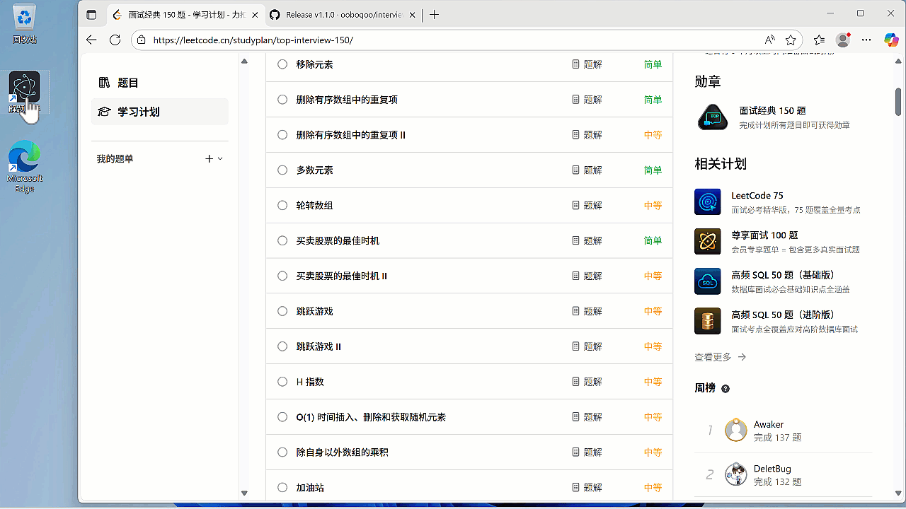

# Interview Coder CN（语音版）



桌面端编程面试辅助工具：截图 → AI 实时分析 → 流式生成解题思路和代码。窗口在屏幕分享时不可见。

## 项目简介

这是一个面向中文用户的编程解题助手，适配国内 AI 生态，简单易用。

### 适用场景

- **编程面试** — 分析屏幕上的题目，实时给出解题思路和代码，即便面试官要求分享屏幕，也不会被发现
- **笔试题目** — 不会导致笔试网页失焦，可规避"跳出网页"检测
- **其他场景** — 英语机试、在线考试等，可通过设置界面配置"自定义提示词"自行扩展

### 核心能力

- 通过全局快捷键抓取屏幕内容，发送给大模型进行分析
- 窗口在屏幕分享时不可见（腾讯会议等主流软件）
- 窗口置顶半透明展示，不会导致原页面失焦，从而规避"跳出网页"检测
- 支持系统音频或麦克风实时语音转文字（STT），截图时自动附带
- 支持 AI 答案语音朗读（TTS），浏览器内置语音或高质量 AI 语音

### 项目特点

- **简单易用** — 只需配置 `API_BASE_URL` 和 `API_KEY` 即可开始使用
- **多题型支持** — 重点支持编程算法题，同时支持单选、多选、解答等题型
- **多语言** — 支持 Python、JavaScript、Java、C++ 等多种编程语言
- **隐身能力** — 即使被要求分享屏幕，面试官也看不到解题助手的界面

## 功能

- **截图分析** — 全局快捷键截图，AI 流式输出答案
- **隐身窗口** — 屏幕分享时不可见（腾讯会议等），置顶半透明，支持鼠标穿透
- **语音转录 (STT)** — 系统音频或麦克风实时转文字，截图时自动附带
- **AI 答案朗读 (TTS)** — 浏览器内置语音（免费）或阿里云百炼 CosyVoice（高音质）
- **语音对话** — `Ctrl+Q` 开始说话，再按结束，AI 回答并朗读
- **面试录音** — `Ctrl+1` 开始 / `Ctrl+2` 停止，同时录制面试官和你自己的语音，按句子分割并带时间戳，方便面试复盘
- **多截图对话** — 同一会话追加截图，支持追问
- **对话导出** — 一键导出 Markdown
- **多平台兼容** — OpenAI / 硅基流动 / DeepSeek / OpenRouter 等任意 OpenAI 兼容 API

## 快速开始

> 项目运行依赖 Node.js 环境，如未安装请先访问 [Node.js 官网](https://nodejs.org/zh-cn/download) 下载安装。

```bash
npm install
npm run dev
```

启动后进入「设置」页面，配置 `API Base URL` 和 `API Key`。

也可在项目根目录创建 `.env` 文件预配置，程序启动后会自动读取作为默认值：

```env
API_BASE_URL="https://api.deepseek.com/v1"
API_KEY="sk-..."
MODEL="deepseek-v4-pro"
```

### 配置 API 服务商

API 地址和 API Key 可从支持 OpenAI API 格式的服务商获取，例如：

- [硅基流动 (SiliconFlow)](https://cloud.siliconflow.cn/) — 国内服务商，支持支付宝
- [DeepSeek](https://platform.deepseek.com/) — 国内服务商，性价比高
- [OpenRouter](https://openrouter.ai/) — 聚合服务，模型选择丰富
- OpenAI 官方 API — 海外用户可直接使用

### 视觉模型配置（重要）

本项目核心功能依赖截图 → AI 视觉解析 → 解题。不同模型对图片的支持情况不同，请根据所选模型选择对应路径：

```text
                        选择 AI 模型
                             │
              ┌──────────────┴──────────────┐
              │                             │
              ▼                             ▼
     ┌────────────────┐           ┌────────────────┐
     │ ✅ 支持图片     │           │ ❌ 不支持图片   │
     │ (GPT-4o / VL)  │           │ (DeepSeek等)   │
     └───────┬────────┘           └───────┬────────┘
             │                             │
             ▼                             ▼
     ┌──────────────┐           ┌──────────────────────────┐
     │   直连模式    │           │      双模型模式            │
     │              │           │                          │
     │ 截图 ──→ AI  │           │ ① 开启「独立视觉模型」     │
     │  看图  解题   │           │ ② 视觉模型识别题目文字     │
     │  流式输出    │           │ ③ 解题模型生成答案        │
     └──────────────┘           └──────────────────────────┘
             │                             │
              └──────────┬────────────────┘
                         │
                         ▼
                  流式输出答案
```

> **路径一：直连模式** — 使用 GPT-4o、Qwen-VL 等视觉模型，截图直接发送，无需额外配置。
>
> **路径二：双模型模式** — 使用 DeepSeek-V4、DeepSeek-Chat 等纯文本模型时，需在「设置 → AI 设置」中：
> 1. 开启 **「使用独立视觉模型」** 开关
> 2. 配置视觉 API（推荐硅基流动 `https://api.siliconflow.cn/v1` + 模型 `Qwen/Qwen3-VL-32B-Instruct`）
> 3. 主模型继续用于解题，视觉模型只负责识别图片中的题目文字

可使用设置页面的「检测 API 连接」和「检测图片解析能力」功能验证配置是否生效。

### 语音与录音功能（需要提前配置）

语音转录（STT）、AI 朗读（TTS）、面试录音等功能依赖 **阿里云百炼平台**，使用前需要：

1. 注册 [百炼平台](https://bailian.console.aliyun.com/) 并创建 API Key
2. 在「设置 → 语音转录」中填入百炼 API Key
3. 同时确保「AI 设置」中的模型 API 已正确配置（语音对话需要调用 AI 模型作答）

> **两项 API 缺一不可**：百炼 API 负责语音识别/合成，模型 API 负责 AI 回答。两者都配置好，语音功能才能正常使用。

**面试录音**（`Ctrl+1` 开始 / `Ctrl+2` 停止）可同时录制系统音频（面试官）和麦克风（你自己），通过 Fun-ASR 实时转写为带时间戳和说话人标签的对话记录。主要用途：

- **面试复盘** — 回顾整场面试的问答内容，发现不足之处
- **提供给 AI 分析** — 将录音转写文本配合简历背景信息，让 AI 分析面试表现并给出改进建议

## 🙏 鸣谢

特别感谢 **AI 镜像站站长** 提供的 AI 辅助支持！

> 🧭 **导航站**：[4399520.xyz](https://4399520.xyz)
> 🛒 **发卡网**：[ai.4399520.xyz](https://ai.4399520.xyz)

该镜像站支持 **天卡、周卡、月卡** 等多种灵活套餐，满足不同需求人群的使用场景。目前已稳定运行 **两年多**（截止 2026.5.10），性价比高、使用便捷，在本项目开发过程中提供了大量 AI 技术支持，特此致谢！

## ⚠️ 免责声明

本项目采用的屏幕分享隐匿方案基于主流屏幕共享软件（如腾讯会议、Zoom 等）的已知行为实现。由于各软件版本持续更新，**防检测效果可能因软件版本、系统环境而异**，建议在正式使用前自行测试验证。

本项目**仅供学习交流和技术可行性研究**，严禁用于任何考试作弊、面试欺诈或其他违法违规用途。使用者应自行承担因使用本工具而产生的一切后果与风险，项目作者不承担任何责任。

### （可选）配置语音功能

语音转录和高质量 TTS 功能使用阿里云百炼平台，需要额外配置：

1. 访问 [百炼平台控制台](https://help.aliyun.com/zh/model-studio/get-api-key) 注册并创建 API Key
2. 在应用「设置」页面的「语音转录」部分填入 API Key
3. STT 使用 Fun-ASR 模型（0.02 元/分钟，新用户有 10 小时免费额度）
4. TTS 可选免费的浏览器内置语音，或付费的 CosyVoice（更高音质）

### ⚠️ 启用"立体声混音"捕获系统音频（重要）

如果要捕获电脑播放的声音（**一般是获取面试官的语音**），这是关键步骤。下面的步骤用于启用 Windows 自带的"立体声混音 (Stereo Mix)"虚拟音频设备。

如果要捕获电脑播放的声音（如面试官在视频通话中的语音），需要启用 Windows 自带的"立体声混音 (Stereo Mix)"虚拟音频设备。

1. 右键任务栏的 **🔊 声音图标** → 选择 **"声音设置"**
2. 向下滚动，点击 **"更多声音设置"**（或直接搜索"更改系统声音"）
3. 切换到 **"录制"** 选项卡
4. 在设备列表空白处 **右键** → 勾选 **"显示禁用的设备"**
5. 找到 **"立体声混音"（Stereo Mix）**→ 右键 → **"启用"**
6. 再次右键"立体声混音"→ **"设置为默认设备"**（可选，但推荐）
7. 点击 **"确定"** 保存

完成后，打开应用进入「设置」，在"音频来源"中选择"系统音频"，然后在下拉列表中选择 **"立体声混音"** 设备即可。

> **注意**：部分笔记本或精简版 Windows 可能没有 Stereo Mix 驱动。如果设备列表中没有该选项，可尝试安装厂商官方声卡驱动（如 Realtek High Definition Audio），或使用第三方虚拟音频工具（如 VB-Cable）。

### （可选）面试录音与复盘

按 `Ctrl+1` 开始录音，`Ctrl+2` 停止录音，同时捕获系统音频（面试官）和麦克风（你自己），通过 DashScope Fun-ASR 实时转写为带时间戳的对话记录，静默保存为 Markdown 文档。

- 每句话结束后自动写入文档，包含时间戳和说话人标签（**面试官** / **我**）
- 录音期间截图会自动保存到记录中
- 按 `Ctrl+2` 停止录音
- 录音文件保存在「设置 → 录音设置 → 录音保存目录」指定的路径下（默认：`文档/InterviewCoder/Records`）

## 快捷键

| 键位 | 功能 |
| ---- | ---- |
| `Alt+Enter` | 截图分析（中断当前连接 + 新会话） |
| `Alt+Shift+Enter` | 追加截图 |
| `Ctrl+/` | 另一种解法（对当前答案不满意时） |
| `Alt+.` | 停止生成 |
| `Ctrl+Q` | 语音对话模式 |
| `Alt+T` | 语音转录 |
| `Ctrl+1` | 开始面试录音 |
| `Ctrl+2` | 停止面试录音 |
| `Alt+B` | 切换 TTS 朗读 |
| `Alt+H` | 显示/隐藏窗口 |
| `Alt+M` | 鼠标穿透 |
| `Ctrl+J` / `Ctrl+K` | 上下翻页 |
| `Ctrl+↑↓←→` | 移动窗口 |

## 关于隐身能力的说明

目前隐身功能适配市面上大部分会议软件（如腾讯会议等），但少数软件和浏览器可能无法正常隐身。使用前请自行测试，本项目不承担任何责任。

## 技术栈

| 层级 | 技术 |
| ---- | ---- |
| 框架 | Electron 37 (electron-vite 4) |
| 前端 | React 19, TypeScript 5.8 |
| 样式 | Tailwind CSS v4, shadcn/ui (New York) |
| 状态管理 | Zustand 5 |
| AI | Vercel AI SDK (`ai` + `@ai-sdk/openai`)，流式输出 |
| STT | 阿里云百炼 Fun-ASR (WebSocket, PCM 16kHz) |
| TTS | Web Speech API（免费）+ 阿里云百炼 CosyVoice (WebSocket, PCM 24kHz) |

## 类似项目

- [cheating-daddy](https://github.com/sohzm/cheating-daddy) — Soham Parekh 的作品
- [glass](https://github.com/pickle-com/glass)
- [interview-coder-withoupaywall-opensource](https://github.com/j4wg/interview-coder-withoupaywall-opensource)

## 许可

本项目采用 [CC BY-NC 4.0](https://creativecommons.org/licenses/by-nc/4.0/deed.zh) 协议许可。

您可以自由使用、复制、修改本项目代码，但 **禁止任何形式的商业用途**，包括但不限于售卖、集成入商业产品、SaaS 服务等。如需商业授权，请联系作者获得书面许可。

---

本项目基于 [ooboqoo/interview-coder-cn](https://github.com/ooboqoo/interview-coder-cn) 二次开发，新增了语音交互系统（TTS 朗读、语音对话、麦克风输入、对话导出）。
